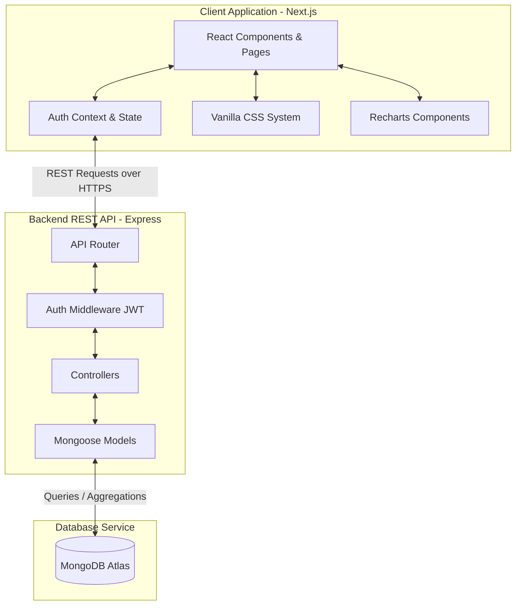
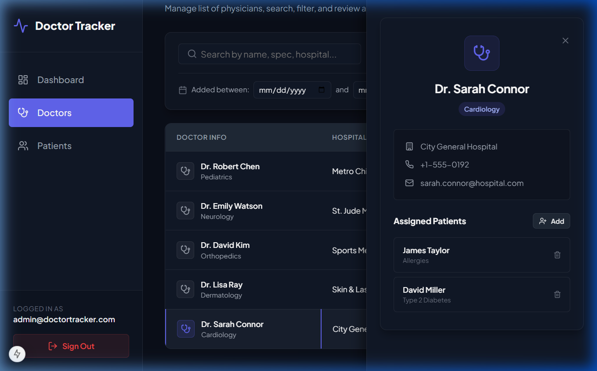
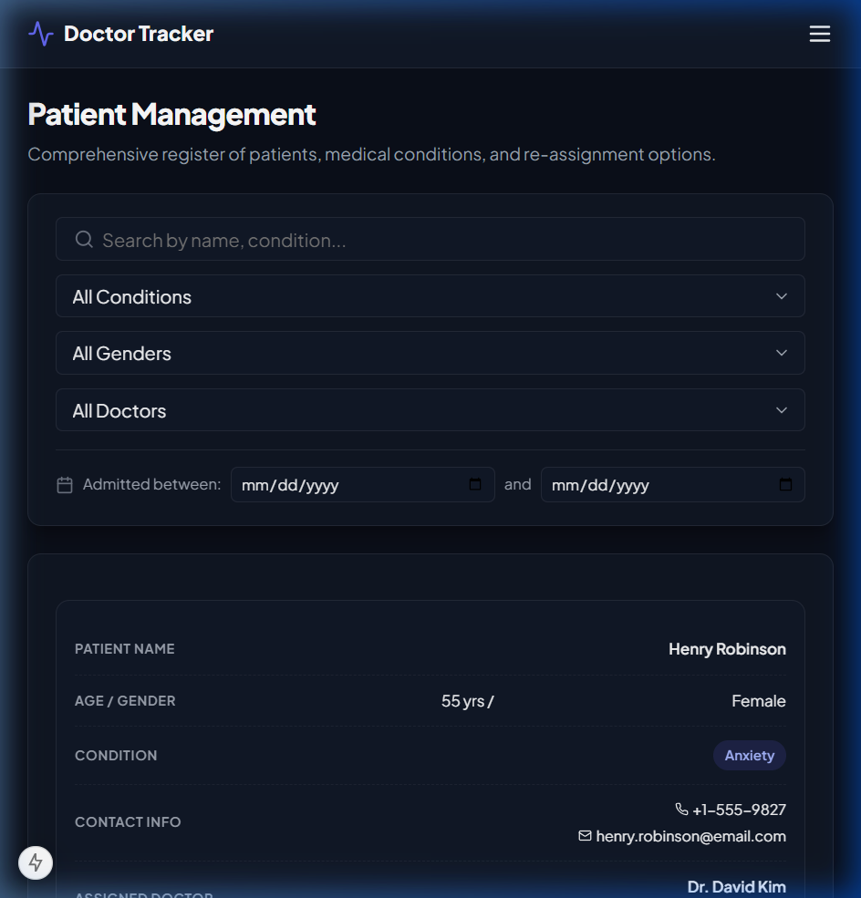
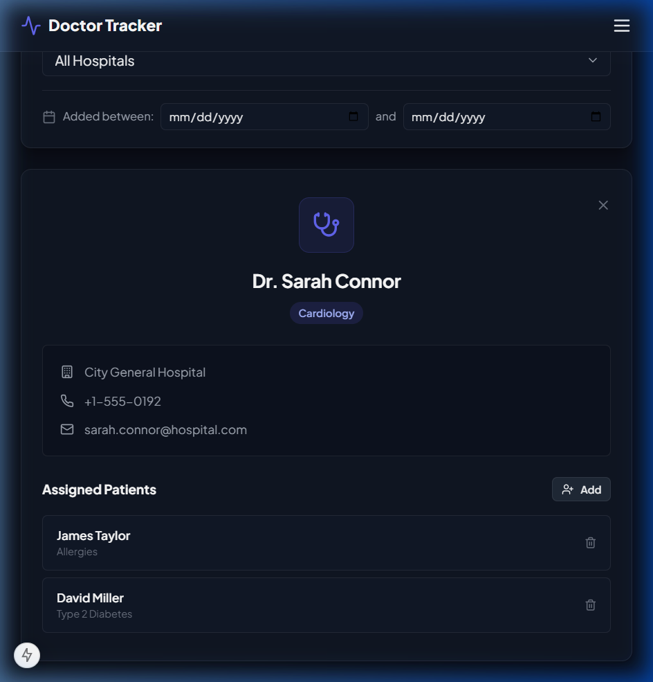
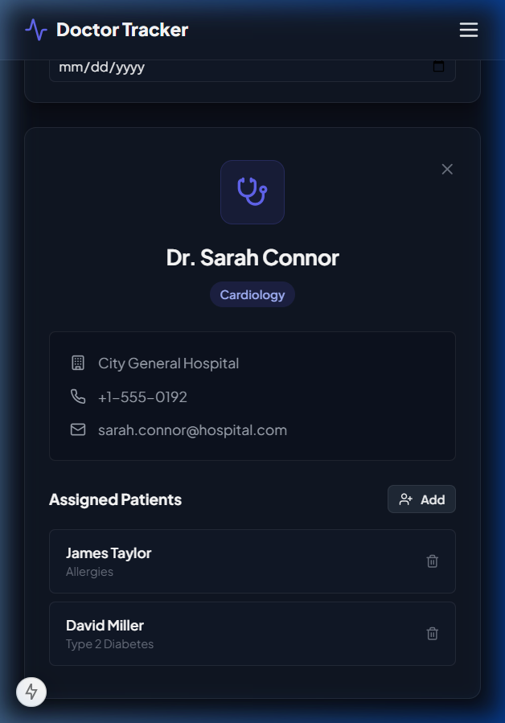

# Doctor Tracker

Doctor Tracker is a secure, high-performance administrative web application designed to help healthcare coordinators manage lists of physicians and their associated patients. Built with a separate, optimized Express/Node.js REST API and a highly responsive Next.js frontend, the platform provides administrators with an intuitive interface for staff and patient enrollment, comprehensive search and filtering capabilities, and dynamic data visualization to monitor patient loads and registration trends.

---

## Setup Guide

Follow these step-by-step instructions to get the Doctor Tracker backend and frontend services running locally.

### Prerequisites
- [Node.js](https://nodejs.org/) (v18.x or higher)
- [MongoDB Atlas](https://www.mongodb.com/cloud/atlas) or a running local MongoDB instance
- npm or yarn

### 1. Database Configuration
1. Obtain your MongoDB connection string (e.g. from MongoDB Atlas).
2. The backend service will connect to this database to store and fetch user authentication, doctor profiles, and patient charts.

### 2. Backend Installation & Seeding
1. Open your terminal and navigate to the backend directory:
   ```bash
   cd backend
   ```
2. Install the backend dependencies:
   ```bash
   npm install
   ```
3. Create a `.env` file based on the provided template:
   ```bash
   cp .env.example .env
   ```
4. Open the `.env` file and fill in your configuration:
   ```env
   PORT=5000
   MONGODB_URI=your_mongodb_connection_string
   JWT_SECRET=your_secure_jwt_secret_key
   ```
5. Seed the database with default administrative credentials and sample doctor/patient records:
   ```bash
   npm run seed
   ```
   *Note: This will output details for the default admin user:*
   - **Email:** `admin@doctortracker.com`
   - **Password:** `admin123`
6. Start the Express development server:
   ```bash
   npm run dev
   ```
   *The server will start running on [http://localhost:5000](http://localhost:5000).*

### 3. Frontend Installation & Execution
1. Open a new terminal window and navigate to the frontend directory:
   ```bash
   cd frontend
   ```
2. Install the frontend dependencies:
   ```bash
   npm install
   ```
3. Verify or create the `.env.local` file to specify the backend REST API base URL:
   ```env
   NEXT_PUBLIC_API_URL=http://localhost:5000/api
   ```
4. Start the Next.js client development server:
   ```bash
   npm run dev
   ```
5. Open your browser and navigate to [http://localhost:3000](http://localhost:3000) to access the administrative portal.

---

## System Architecture

Doctor Tracker uses a decoupled, client-server system architecture:



### Data Flow Overview
1. **User Authentication**: The client submits email/password credentials to `/api/auth/login`. Upon validation, the server returns a signed JSON Web Token (JWT). The client stores this token in `localStorage` and appends it to subsequent request headers.
2. **Data Aggregation**: When the administrator loads the Dashboard, the client requests statistics from `/api/dashboard/stats`. The server executes high-performance aggregation pipelines on MongoDB (e.g. counting documents, sorting load-levels, grouping admissions by date) and responds with formatted JSON.
3. **Doctor & Patient Management**: Listing views make calls to `/api/doctors` and `/api/patients` with query parameters. The controllers perform indexed searches, regex filtering, and paginated skipping, then return a slice of database records alongside overall pagination metadata.

---

## Technical Decisions

### 1. Decoupled Next.js Client & Standalone Express API over Next.js Server Actions
* **Decision**: We chose to implement the frontend as a separate Next.js client application and the backend as a standalone Node.js/Express server rather than using a single monolithic Next.js project with Server Actions.
* **Rationale**: Decoupling the client and API layers enforces a strict boundary between presentation and business logic. It allows the REST API to be reused in the future for other applications (such as a separate patient-facing portal or mobile app). In addition, hosting and scaling the server independently prevents heavy analytical database aggregation queries from resource-starving page loads, leading to better operational performance.

### 2. React Context API over Redux for State Management
* **Decision**: We chose the native React Context API (`AuthContext`) rather than introducing Redux or another third-party state manager.
* **Rationale**: The state requirements of Doctor Tracker are highly localized. The only global application-wide state is the administrative authentication session (JWT token, user profile, and page route protection logic). Using the React Context API provides a lightweight, performant, and native solution that avoids boilerplate code, prevents unnecessary dependencies, and keeps the client bundle size minimal.

### 3. MongoDB Compound & Single Indexing for Queries
* **Decision**: We structured database queries utilizing Mongoose schemas with explicit indexing (e.g. index on `doctor` ID, compound text indexes on doctor/patient names, and indexes on filter properties like `specialization`, `hospital`, and `dateAdded`).
* **Rationale**: By indexing fields used in search inputs, dropdown filters, and sorting criteria, MongoDB can satisfy queries using Index Scans (IXSCAN) rather than full Collection Scans (COLLSCAN). This ensures sub-millisecond response times even when scaling the database to thousands of records.

---

## Visual Evidence

### 1. Desktop Views (1440px)

#### Login Screen
*Clean glassmorphism authentication card.*


#### Administrative Dashboard
*Analytical metrics summary cards, active Recharts area trend chart, and specialization load bar charts.*


#### Doctor Directory (Split View)
*Split-screen layout displaying the doctor listing on the left, and the detailed profile pane on the right.*


#### Patient Catalog Directory
*Tabular display of patient registry supporting pagination, text filters, and quick action modulators.*


---

### 2. Laptop View (1100px)

#### Doctor Directory (Slide Drawer Overlay)
*Laptop-optimized layout displaying the doctor details as an overlay side drawer that slides in from the right edge.*


---

### 3. Tablet Views (768px)

#### Patient Directory (Tablet Card Layout)
*Tablet-optimized list converting data rows into standalone summary cards.*


#### Doctor Details (Tablet Block View)
*Tablet-optimized full-screen doctor details view which completely replaces the list layout when active.*


---

### 4. Mobile Views (375px)

#### Navigation Drawer & Dashboard Metrics
*Dashboard metrics layout reflowed vertically with hamburger-triggered navigation drawer.*


#### Doctor Directory - List Cards (Mobile)
*Doctor listing styled as independent cards containing specialized stats.*


#### Doctor Directory - Details Screen (Mobile)
*Details view replacing the list on mobile when a row is active, containing full patient loaders.*


#### Patient Directory - Card Registry (Mobile)
*Patients directory transforming tables to card rows containing inline contact icons and actions.*

