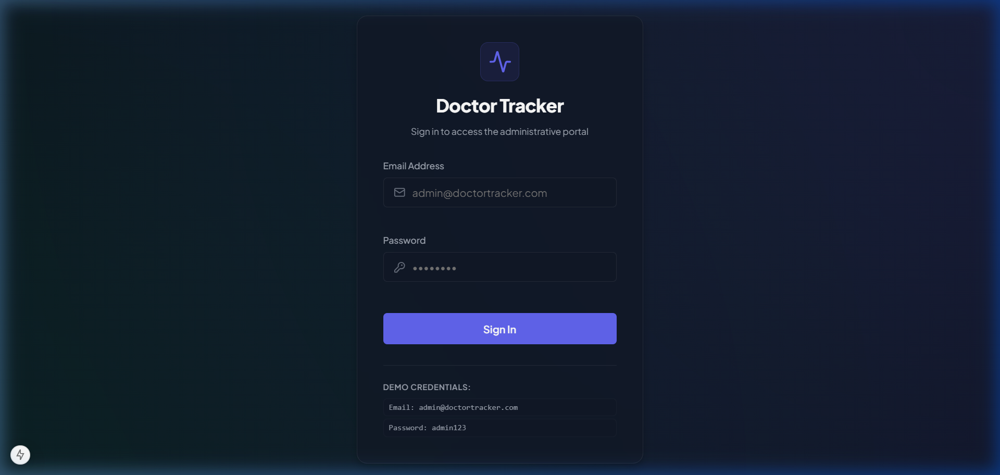
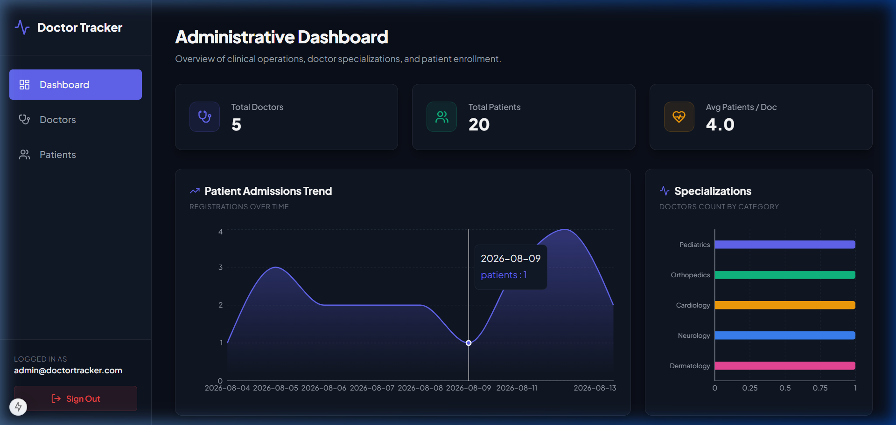
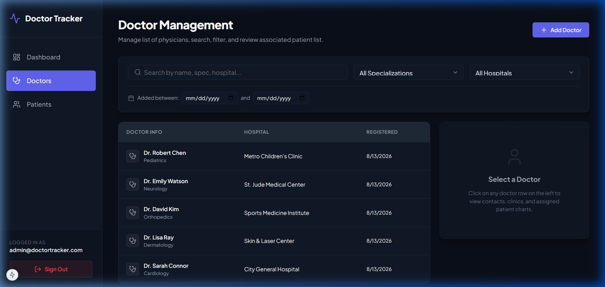
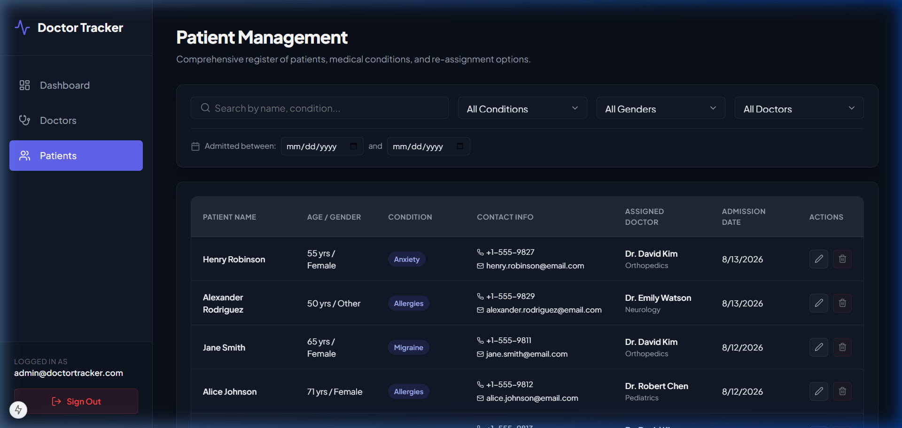
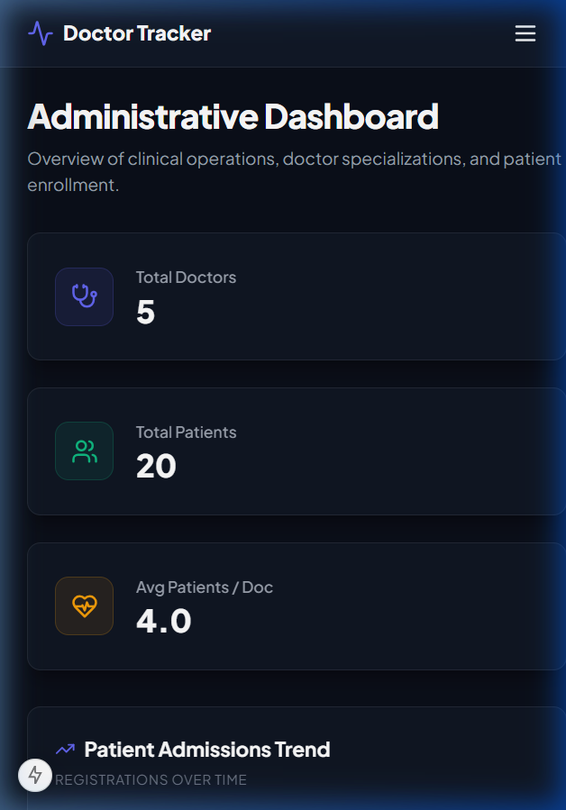
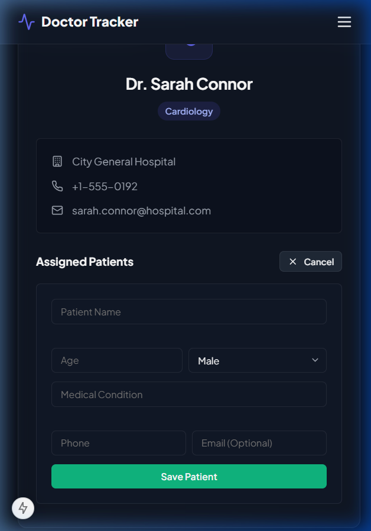
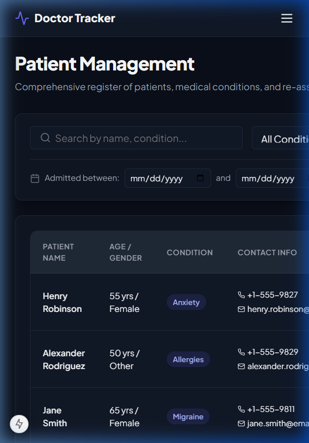

# Doctor Tracker Client - Next.js 15 Administrative Portal

This repository contains the standalone frontend administrative client application for **Doctor Tracker**. It is a modern, high-performance web dashboard built using Next.js 15, React, TypeScript, and a custom Vanilla CSS design theme.

---

## 1. Technology Stack & Key Libraries

* **Framework**: [Next.js 15](https://nextjs.org/) (App Router, clientside routing, dynamic layout structure)
* **Language**: [TypeScript](https://www.typescript.org/) (Strict typing for components, state, context, and models)
* **State Management**: React Context API (`AuthContext`)
* **Visualizations**: [Recharts](https://recharts.org/) (Responsive daily trend area charts and specialization patient load bar charts)
* **Icons**: [Lucide React](https://lucide.dev/) (Subtle vector dashboard and navigation iconography)
* **Styling**: Vanilla CSS (`src/app/globals.css`)
  * Premium Slate & Indigo dark theme palette
  * Custom styled select fields with vector dropdown chevrons
  * Smooth micro-animations and slide-over navigation overlays

---

## 2. Key Client Features

### Global Authentication Context & Router Guards
The client uses an `AuthContext.tsx` provider wrapping the application root. It handles JWT authentication state, token storage inside `localStorage`, and intercepts client-side route navigation:
* Unauthenticated administrators are automatically redirected to `/login` when trying to access `/dashboard`, `/doctors`, or `/patients`.
* Authenticated admins are redirected away from `/login` back to the `/dashboard`.

### Doctors Directory (Split-View Design)
* **Split Layout**: Utilizes a dual-column layout. On the left is the filterable list of doctors, and on the right is a sticky detail panel displaying the selected doctor's details and their assigned patients.
* **Responsive Slide Drawer**: On screen widths smaller than `1200px` (laptops, tablets, mobiles), the detail panel converts automatically into an overlay slide-over side drawer from the right, ensuring clean focus and accessibility.
* **Patient Operations**: Admins can assign existing patient records directly to a doctor within the doctor's details card, or delete patient assignments.

### Patients Catalog (Comprehensive Directory)
* **Rich Filtering & Fuzzy Search**: Text-searching on patient names and conditions, combined with dropdown filters for gender, condition, and doctor.
* **Creation and Update Modals**: Responsive edit modal allowing admins to update age, gender, condition, and doctor assignment.

---

## 3. Setup & Running Instructions

### Prerequisites
* [Node.js](https://nodejs.org/) (v18 or higher installed)
* A running instance of the Doctor Tracker Backend API server (defaults to port `5000`)

### Installation
1. Clone this repository to your frontend host.
2. Install dependencies:
   ```bash
   npm install
   ```

### Configuration (`.env.local`)
Create a `.env.local` file in the root folder of the frontend project:
```env
NEXT_PUBLIC_API_URL=http://localhost:5000/api
```

### Starting the Client Dev Server
```bash
npm run dev
```
Open [http://localhost:3000](http://localhost:3000) in your browser to view the portal.

### Building for Production
```bash
npm run build
npm run start
```

---

## 4. Visual Evidence (UI Walkthrough)

### Desktop Interfaces

#### Login Screen
Admin login panel featuring a glassmorphism card container.


#### Administrative Dashboard
Responsive Recharts trends and metrics summary.


#### Doctor Directory (Split View)
Select list on the left; sticky details and patient assigner form on the right.


#### Patient Catalog
Comprehensive lists, search, pagination, and multi-criteria filters.


---

### Mobile Interfaces

#### Mobile Responsive Sidebar (Drawer Toggle)
Slide-over sidebar navigation panel toggled by a hamburger menu.


#### Doctor Listing (Adaptive)
Doctors index displaying clear cards and responsive action modals.


#### Patient Listing (Adaptive)
Mobile table scrolling and card components.

